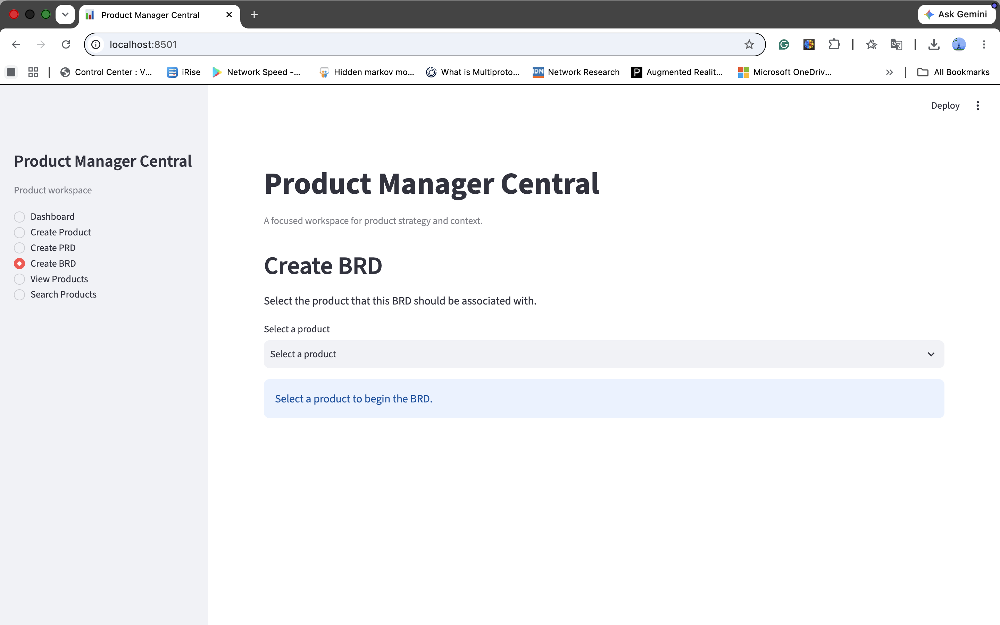

# Product Manager Central

Product Manager Central (PMC) is a focused Streamlit workspace for capturing,
finding, reviewing, editing, and safely deleting structured product information.
It also provides a template-guided builder for product-associated Business
Requirements Documents (BRDs) and Product Requirements Documents (PRDs). Data
is stored locally in SQLite. Phase 8 uses deterministic structured templates
and does not create or integrate an LLM, call an AI API, or require API tokens.

## MVP scope

The MVP provides dependable local product-information management for a single
user. It covers structured product records, validation, search, lifecycle
status, dashboard counts, and safe edit/delete workflows in one Streamlit
application. It also supports guided BRD and PRD authoring. Document content is
entered by the user rather than generated by an AI service.

## Application Preview

!

## Current capabilities

- Dashboard metrics for total, active, launched, and recently updated products.
- Canonical creation form with required and optional product context.
- Compact product list and complete product detail views.
- Case-insensitive search across all approved text fields.
- Prepopulated editing of every appropriate product field.
- Centralized validation and normalization for both create and edit.
- Permanent ID-based deletion with an explicit two-step confirmation.
- Persistent local SQLite storage.
- BRD and PRD creation from an existing product, with one-time prepopulation.
- Draft saving, Approved-state completeness validation, formatted previews,
  multiple documents per product, and stable document ID-based editing.
- Separate Create PRD and Create BRD primary navigation paths with explicit,
  ID-safe product selection.

Duplicate product names are allowed. Updates and deletion always target the
product ID rather than its name.

## Dashboard metrics

The dashboard provides four portfolio counts:

- Total products includes every saved product.
- Active products includes every product whose status is not `archived`.
- Launched products includes products whose status is `launched`.
- Updated in the last 30 days includes products whose `updated_at` value is
  exactly at or later than the 30-day cutoff.

The dashboard intentionally contains no charts or advanced analytics.

## Product fields

Required fields:

- Name
- Description
- Target users
- Business goal
- Status

Optional fields:

- Customer problem
- Product strategy
- Notes

System-managed fields:

- ID
- Created timestamp
- Updated timestamp

Approved statuses are `idea`, `discovery`, `planning`, `in_development`,
`launched`, and `archived`. New products default to `discovery`.

## Validation rules

All editable text is trimmed at its outer edges while internal paragraphs and
line breaks are preserved. Required values cannot be empty or whitespace-only.
Blank optional fields are stored as `NULL`.

| Field | Requirement | Maximum length |
| --- | --- | ---: |
| Name | Required | 120 |
| Description | Required | 2,000 |
| Target users | Required | 1,000 |
| Business goal | Required | 2,000 |
| Status | Required; approved value only | — |
| Customer problem | Optional | 2,000 |
| Product strategy | Optional | 3,000 |
| Notes | Optional | 5,000 |

ID and timestamps are system-managed and cannot be supplied through product
forms. Validation reports all discovered field errors together.

## Architecture

PMC deliberately uses a small MVP architecture:

- `app.py` contains the single Streamlit application and workflow state.
- `src/models.py` defines the canonical `Product` and field categories.
- `src/document_templates.py` defines stable BRD/PRD section keys, labels,
  guidance, order, and prepopulation mappings.
- `src/validation.py` provides reusable validation and normalization.
- `src/database.py` owns parameterized SQLite initialization, product and
  document persistence, search, dashboard metrics, and controlled migrations.
- `tests/` contains isolated validation, database, presentation-helper, and
  Streamlit workflow tests.
- `requirements.txt` lists the Streamlit and pandas runtime dependencies.
- `data/pmc.db` is the only live application data source.

Documents are normalized across `documents` and `document_sections` tables.
SQLite foreign keys are enabled, product deletion cascades to its documents,
and document listings use a product-ID index. Database operations remain
outside the Streamlit view code. No ORM, service layer, separate view layer, or
general schema framework is used.

## Setup

Create and activate a virtual environment, then install the runtime
dependencies:

```bash
python3 -m venv .venv
source .venv/bin/activate
python -m pip install -r requirements.txt
```

Run the application:

```bash
streamlit run app.py
```

The application uses `data/pmc.db` by default. For isolated development or
manual testing, point the application at a disposable database:

```bash
PMC_DATABASE_FILE=/tmp/pmc-test.db streamlit run app.py
```

Never use the live Product Manager Central record for destructive testing.

## Tests

Run the complete suite:

```bash
PYTHONDONTWRITEBYTECODE=1 .venv/bin/python -m unittest discover -s tests -v
```

All automated tests use temporary databases. They do not read from or write to
`data/pmc.db`.

## Product workflows

Creating a product uses every approved editable field, defaults status to
`discovery`, validates the complete submission, and saves one canonical record.

View Products lists name, readable status, a compact target-user summary, and
updated time. Selecting a product by ID opens every stored field and both
system-managed timestamps. Search is case-insensitive across all approved text
fields; an empty query returns the complete list.

Editing loads the selected product's current values into the shared canonical
form. Invalid submissions display all discovered errors and do not update the
database. Successful edits preserve the product ID and original creation
timestamp, advance the updated timestamp, and return to the refreshed detail
view.

Deleting requires two distinct actions. The first Delete action only opens a
warning that names the product and ID. The user must then choose Delete
permanently or Cancel. Cancel does not change the database. A successful
confirmation deletes exactly one product ID and returns to the product list.
The warning reports the number of associated documents that SQLite will also
delete through `ON DELETE CASCADE`.

## Product document workflow

Use Create PRD or Create BRD in the primary navigation, then explicitly select
the associated product. Product labels include the database ID so duplicate
names remain unambiguous. The appropriate deterministic form opens only after a
product is selected. If no products exist, PMC explains that Create Product is
the required first step and provides a direct navigation action.

Alternatively, open an existing product in View Products and choose Create
Document as a secondary convenience. Both entry points use the same form,
prepopulation, validation, persistence, preview, and stable-ID editing behavior.
New documents default to version `1.0` and Draft status.

Draft documents require a product association, type, title, version, and valid
status; body sections may remain empty. Approved documents require content in
every section, and validation identifies each incomplete section. Titles allow
up to 200 characters, versions allow up to 50 characters of nonblank free text,
and each long-form section allows up to 10,000 characters.

Saved documents are listed only under their associated product and identified
by stable database IDs. A product can have multiple BRDs and PRDs. Opening a
document displays a formatted preview; Edit updates that same document ID.
Prepopulated content is a starting snapshot and does not change when the product
is edited later. Phase 8 does not include document deletion, Word/PDF export,
or AI-generated content.

The interface uses readable status labels, guided empty states, consistent
user-safe messages, and full-width detail sections so long product context
remains readable.

## Data protection

The following local data is intentionally excluded from Git:

- `data/*.db` and SQLite sidecar files
- disposable `*.db` files and their sidecars outside `data/`
- `backups/`
- `archive/products.csv`
- `pasted-text.txt`
- `.venv/`
- Python, test, and tool caches
- operating-system files
- `.env` and other secret-bearing environment files

Before application phases that could affect persistence behavior, create and
verify a permanent timestamped database backup. Verify SQLite integrity,
record counts, every product value, and checksums before and after the work.

Disposable manual testing must set `PMC_DATABASE_FILE` to a temporary database.
Disposable products must never be created in `data/pmc.db`, and permanent
backups and `archive/products.csv` must remain unchanged.

## Deferred features

- Generative AI, external LLM APIs, RAG, and prompt management
- AI-generated content and Word/PDF document export
- Authentication, multi-user permissions, and cloud deployment
- Analytics integrations, charts, and advanced styling frameworks
- ORM, service-layer, separate view-layer, or general migration frameworks

## Development status

Phases 0 through 7 are complete. Phase 8 implements the deterministic Product
Document Builder without an LLM, AI API, credentials, export, authentication,
or cloud deployment.
