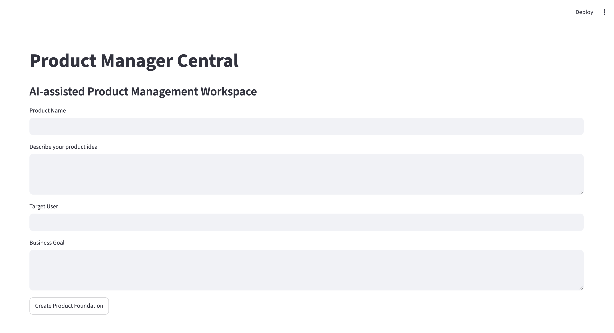

# Product Manager Central

Product Manager Central (PMC) is a generative AI product management application under development, designed to help product managers create, organize, and improve essential product artifacts.

## Product Vision

Product managers often create strategies, requirements, user stories, acceptance criteria, risks, and success metrics across multiple disconnected tools.

PMC’s long-term vision is to provide one structured workspace where product managers can maintain product context and use generative AI to produce high-quality product management artifacts.

## Current Status

Phases 0 through 4 are complete. PMC now has a protected canonical SQLite database and a clean Streamlit interface for dashboard metrics, canonical product creation, product listing and detail views, and search.

Phase 5 edit and delete workflows have not started. No external AI model is connected, and PMC does not generate product artifacts using a large language model.

## Current Capabilities

- Streamlit user interface
- Dashboard metrics for total, active, launched, and recently updated products
- Structured product creation using every canonical editable field
- Complete saved-product detail views
- Case-insensitive search across approved product text fields
- Clear centralized validation errors that prevent invalid saves
- Persistent SQLite storage
- Canonical product data model
- Centralized input validation and normalization
- Database backup and controlled migration
- Automated validation and database tests
- Modular Python project structure
- Product and technical documentation

## Planned Generative AI Capabilities

Future versions of PMC are planned to help product managers create and improve:

- Product strategies
- Customer problem statements
- Product requirements
- User stories
- Acceptance criteria
- Success metrics and KPIs
- Risks and assumptions
- Roadmap recommendations
- Additional product-management documents

## Technology Stack

- Python
- Streamlit
- SQLite
- Pandas
- Pytest
- Generative AI and LLM integration — planned
- Retrieval-augmented generation (RAG) — future roadmap

## Project Structure

- `app.py` — Streamlit application entry point
- `src/database.py` — SQLite initialization and database operations
- `src/models.py` — canonical Product data model and approved statuses
- `src/validation.py` — centralized validation and normalization
- `tests/test_validation.py` — automated validation tests
- `tests/test_database.py` — automated database tests
- `tests/test_app_helpers.py` — automated tests for UI presentation helpers
- `PROJECT_SPEC.md` — approved product and technical scope
- `IMPLEMENTATION_PLAN.md` — phase-by-phase development plan
- `IMPLEMENTATION_LOG.md` — development and verification history
- `DECISIONS.md` — architecture and product decision record

The live database, backups, virtual environment, and preserved legacy data are intentionally excluded from GitHub.

## Run the Application

### 1. Clone the repository

```bash
git clone https://github.com/Celso-PM-AI/product-manager-central.git
cd product-manager-central
```

### 2. Create a virtual environment

```bash
python3 -m venv .venv
source .venv/bin/activate
```

### 3. Install the dependencies

```bash
pip install -r requirements.txt
```

### 4. Start PMC

```bash
streamlit run app.py
```

## Run the Tests

Run the complete automated test suite from the project root:

```bash
python -m unittest discover -s tests -v
```

Automated tests must not be run against the live database in `data/pmc.db`.

## Development Roadmap

- [x] Protect the existing product data
- [x] Establish the project structure and documentation
- [x] Implement the product model and centralized validation
- [x] Complete database operations and canonical schema migration
- [x] Build dashboard, create, view, detail, and search workflows
- [ ] Add edit and confirmed-delete workflows
- [ ] Generate product-management artifacts
- [ ] Integrate an LLM and prompt-management layer
- [ ] Add artifact review and editing
- [ ] Support document export
- [ ] Add RAG using organizational templates and documentation
- [ ] Add authentication and cloud deployment

## Data Protection

- Do not commit API keys or sensitive product information.
- Do not run automated tests against `data/pmc.db`.
- Back up the live database before any schema change.
- Keep database files and backups out of Git.
- Preserve `archive/products.csv` as historical data.
- Do not test deletion using the preserved Product Manager Central record.
- Store local secrets in `.env` files, which are excluded through `.gitignore`.

## Development Approach

PMC is developed incrementally, one approved phase at a time. Each phase includes manual or automated verification and an approval checkpoint before the next phase begins.

This approach demonstrates product planning, requirements definition, data modeling, validation, automated testing, controlled database migration, documentation, and responsible generative AI product development.

## Portfolio Context

PMC demonstrates how an AI Product Manager can translate a product vision into an incrementally delivered technical solution.

The project combines product strategy with hands-on experience in Python, Streamlit, SQLite, application architecture, data protection, testing, migration planning, and a roadmap for generative AI integration.

## License

No open-source license has been assigned to this project.
