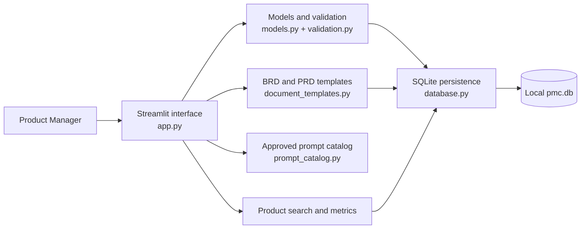
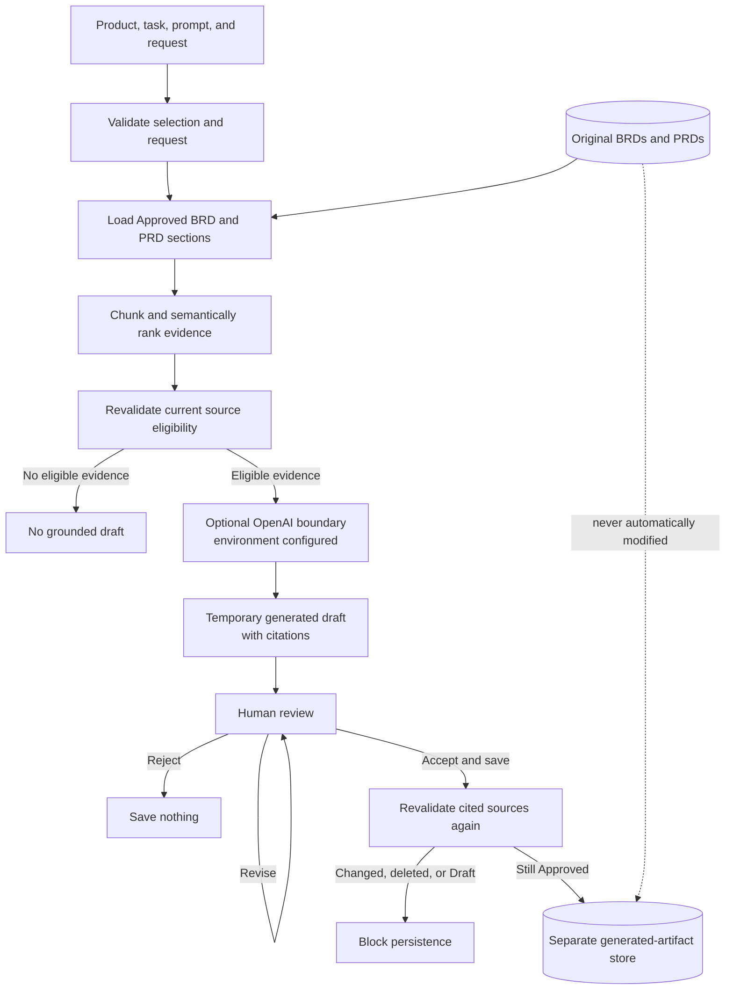
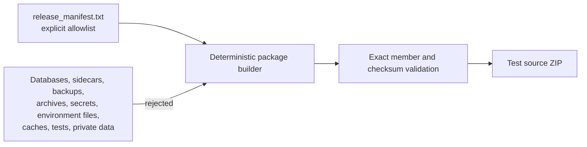

# Product Manager Central Architecture

PMC is a local, single-user Streamlit application. Its architecture keeps
product records and source documents distinct from temporary AI output and
separately accepted generated artifacts.

## Application and local-data architecture

The interface owns navigation and transient workflow state. Models and
centralized validation define the product and document contracts. Templates
provide stable BRD/PRD sections and controlled prepopulation. Parameterized
database functions own initialization, migrations, persistence, search,
dashboard metrics, and retrieval-eligible document reads.

The database is local application data. It is never allowlisted into a release
archive, and fictional samples are loaded only after an explicit user action.

## Approved-source generation and acceptance

Only Approved BRDs and PRDs are eligible for retrieval. Ranked chunks carry
product, document, type, section, and stable-ID metadata into visible citations.
A provider response remains temporary and cannot be saved directly. The Product
Manager reviews the original output, may revise or reject it, and must invoke a
separate acceptance action.

Acceptance rechecks every cited source. If any source is missing, changed, or no
longer Approved, PMC saves nothing. A successful acceptance writes content and
citation snapshots into generated-artifact tables. Original BRDs and PRDs are
never automatically modified.

The OpenAI boundary is optional. Without `OPENAI_API_KEY`, non-AI workflows stay
available and generation stops before client construction or a provider call.
Tests inject deterministic fake or mocked providers instead of making live
calls.

## Source-package boundary

The builder reads one repository-relative path per manifest line. It does not
glob the repository or copy a staging tree. Member order, timestamps,
compression, and permissions are normalized for repeatable output. The builder
validates exact membership, produces a SHA-256 file, refuses accidental
overwrite, and rejects prohibited artifact classes.

This is build capability, not publication authority. An official archive, tag,
GitHub Release, or public posting requires later explicit approval.

## Responsibility map

| Area | Primary source |
|---|---|
| Streamlit navigation and review UI | `app.py` |
| Product and document models | `src/models.py` |
| Validation and normalization | `src/validation.py` |
| BRD/PRD structure | `src/document_templates.py` |
| SQLite persistence and eligible-source reads | `src/database.py` |
| Provider isolation | `src/ai_service.py` |
| Approved prompt definitions | `src/prompt_catalog.py` |
| Chunking and semantic ranking | `src/semantic_retrieval.py` |
| Grounded prompts and citations | `src/grounded_generation.py` |
| Human review and acceptance | `src/generated_content.py` |
| Offline evaluation | `src/rag_evaluation.py` |
| Deterministic source packaging | `scripts/build_release.py` |
