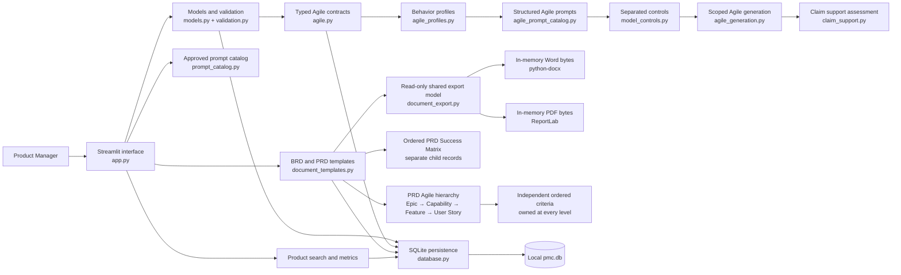
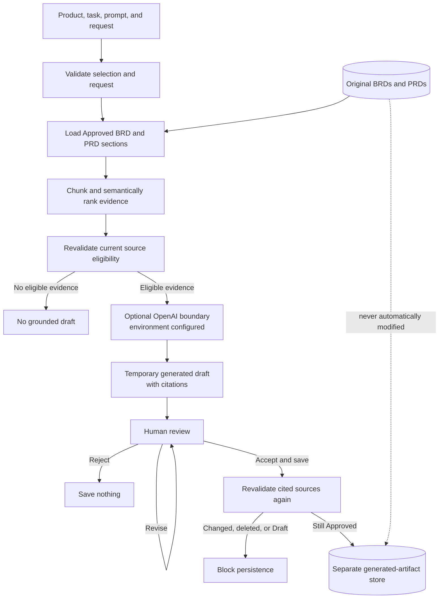
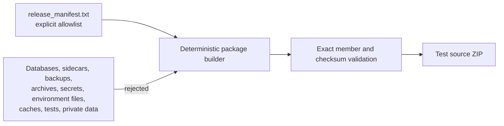

# Product Manager Central Architecture

PMC is a local, single-user Streamlit application. Its architecture keeps
product records and source documents distinct from temporary AI output and
separately accepted generated artifacts. The Checkpoint 7 backend additionally
keeps typed accepted Agile batches separate from the existing generic accepted
artifact history.

## Application and local-data architecture

The interface owns navigation and transient workflow state. Models and
centralized validation define the product and document contracts. Templates
provide stable, grouped BRD/PRD sections and controlled prepopulation. The PRD
Success Matrix is a separate structured child collection rather than a document
section or acceptance-criterion list. Parameterized
database functions own initialization, migrations, persistence, search,
dashboard metrics, and retrieval-eligible document reads.

Checkpoint 11 adds `prd_success_matrix_entries` without rewriting documents or
sections. Entry IDs are stable, positions are unique per PRD, and reads order by
position. Draft rows may persist incomplete values; Approved PRDs require the
measurable validation contract. Existing Checkpoint 10 databases are detected
and upgraded transactionally with an empty matrix table, preserving all prior
rows exactly. Temperature, Top-P, GEPA, and hallucination flags are not PRD
fields; grounding quality is represented as a measurable outcome.

The additive `prd_agile_artifacts` and `prd_agile_acceptance_criteria` tables
store repeatable PRD authoring records separately from accepted generated Agile
artifacts. They reuse the shared artifact types and parent map, retain
document-scoped stable IDs and deterministic ordering, and initialize empty for
existing PRDs without changing legacy user-story, functional-requirement, or
acceptance-criteria section text.

The additive `structured_document_rows` table stores four ordered row types:
PRD contributors, PRD key dates/milestones, BRD hierarchy chains, and linked
BRD risk/mitigation pairs. A document-scoped stable row ID, row type, position,
and validated deterministic JSON payload keep the schema additive while typed
models and centralized validation provide the application contract. Existing
section rows remain sources for backward-compatible editor initialization.
BRD acceptance criteria remain owned by their original Epic, Capability,
Feature, or User Story and are never copied between levels.

Checkpoint 12 adds no schema or persistence path. `document_export.py` receives
an already-loaded Product and saved ProductDocument, validates their stable-ID
association, and builds one immutable ordered content sequence. Both renderers
consume that sequence, so headings, sections, structured rows, blank Draft
labels, and preserved legacy content cannot drift between formats. DOCX and PDF
bytes remain in memory until Streamlit serves a download; user-controlled paths
are never accepted and repository temporary files are never created.

The Word renderer uses explicit US Letter geometry, the
`standard_business_brief` style tokens, fixed-width tables, a restrained memo
masthead, status/page furniture, macro-free Open XML, and scrubbed personal
metadata. The PDF renderer uses the same page geometry and content hierarchy,
an embedded local Unicode font, escaped paragraph input, repeated table headers,
and split-by-row page flow. Safe deterministic filenames are derived from a
sanitized Product slug plus document type/ID/version. Neither path reaches
SQLite, OpenAI, Microsoft Word, a hosted converter, or the network.

## Typed Agile contracts and accepted storage

Checkpoint 7 defines explicit Epic, Capability, Feature, and User Story types.
Each artifact has its own ordered structured acceptance-criterion records,
artifact- and criterion-level source references, optional parent, stable IDs,
review state, provenance, revision, and UTC timestamps. A supplied parent must
follow Epic → Capability → Feature → User Story, exist in the same product batch,
and precede its child. Any artifact type may be an independent root when no
parent is supplied.

The SQLite change is additive. Six `agile_*` tables store accepted generation
runs, typed artifacts, criteria, immutable source-provenance snapshots, and
artifact/criterion source links. The existing `generated_artifacts` and
`generated_artifact_citations` tables are neither rewritten nor reclassified.
Initialization recognizes and transactionally upgrades the exact Phase 9
schema, verifies the five pre-existing table rowsets exactly at the SQL value
level, and is idempotent after upgrade.

Accepted Agile persistence requires an accepted batch and accepted artifacts,
at least one nonblank criterion per artifact, complete product/Approved BRD or
PRD/section traceability, and valid hierarchy. Database checks, unique indexes,
foreign keys, and triggers reject malformed direct writes. Source snapshots do
not reference mutable document rows, so later document edits or deletion do not
rewrite accepted provenance. Deleting the owning product intentionally cascades
through its accepted Agile batches. Pending review remains out of accepted
storage. Profile behavior, generation, support assessment, acceptance workflow,
and UI are not part of Checkpoint 7.

## Agile profiles, prompts, and separated controls

Checkpoint 8 adds three non-persistent contract layers. The profile catalog
defines Strictly Grounded, Balanced, and Exploratory through enums and immutable
policy records, with Strictly Grounded as the fail-closed default. Profile
instructions describe grounding strictness, permitted variation, missing-source
behavior, unsupported-content treatment, citations, assumptions, and inference.
They do not claim that unsupported content has already been detected.

The versioned Agile prompt catalog contains one prompt/task definition for each
artifact type plus structured acceptance criteria. A prompt envelope preserves
separate roles for trusted application instructions, validated application
selections, Product Manager request data, untrusted Approved BRD/PRD source
records, and the output contract. Source text therefore cannot change the
selected prompt, version, profile, artifact type, source scope, or response
schema. Strict response-shape validation covers artifacts, ordered criteria,
claim/source references, missing requirements, and explicitly unsupported,
non-saveable proposals; it does not assess whether claims are supported.

`RetrievalControls.top_k` limits only retrieved Approved-source chunks.
`GenerationControls` has no Top-K field and represents Temperature and Top-P as
separate validated optional controls. Model capabilities decide whether optional
settings are included or whether required unsupported settings fail before an
API request; one control is never substituted for another. Profile behavior
remains the business rule regardless of provider settings.

The [official GPT-5.6 Terra model page](https://developers.openai.com/api/docs/models/gpt-5.6-terra)
documents Responses API and Structured Outputs support. It does not establish
Temperature or Top-P support, so PMC's default capability contract enables only
structured output and omits both sampling controls. No database migration,
provider call, Agile generation, claim-support assessment, or save-workflow
change is part of Checkpoint 8.

## Grounded Agile generation and claim support

Checkpoint 9 adds a separate in-memory workflow in `agile_generation.py`.
Trusted selections are validated before retrieval; only ranked chunks from the
selected product and selected Approved BRD/PRD document scope enter the prompt
envelope. The exact chunks are reloaded and compared before and after provider
execution. The provider is injected, receives the strict response schema and
capability-filtered generation settings, and has no persistence authority.

Structured output is validated before domain construction. Citations resolve
only to context source IDs, preserve deterministic order, and must cover each
artifact title, description, relationship, and acceptance criterion through an
owner-specific claim mapping. Criterion claims use criterion references, so an
artifact-level citation cannot prove them. Malformed output is rejected as one
unit.

`claim_support.py` assigns stable content-derived IDs to field-level claims in
artifact order and returns supported, unsupported, ambiguous, or missing-source
assessments with explicit reasons and evidence IDs. Direct normalized text
correspondence is the only supported result; contradictions, broad
non-contiguous correspondence, absent correspondence, and uncited or unresolved
references remain findings. The method is deterministic and conservative, not
a semantic guarantee. `agile_evaluation.py` reports offline source precision
and recall, artifact/criterion traceability, unsupported-claim recall,
false-positive IDs, missing-requirement recall, and profile conformance.

All Checkpoint 9 outputs remain temporary with `can_save=False`. Checkpoint 10
passes them to `agile_review.py`, which holds immutable original/current
artifacts, configuration, exact chunks, assessments, gates, review versions,
events, reviewers, and reasons in memory. Changed revisions are reassessed;
unchanged revisions do not create a new version. Rejection and blocked output
never reach accepted storage.

Explicit acceptance revalidates the exact chunks and every structural,
citation, claim, criterion, gap, and proposal gate. The reviewed database entry
point independently repeats deterministic claim support and compares a
full-section digest inside the existing accepted-Agile transaction. This closes
session-state bypass and check/save races while retaining Checkpoint 7 rollback
and idempotency. Only accepted artifacts, criteria, hierarchy, provenance,
revision, prompt version, profile, timestamps, and source snapshots persist;
there is no Checkpoint 10 schema migration.

Checkpoint 11 exposes this lifecycle through the AI Assistant. UI controls
select only the current Product's Approved sources and approved profiles;
retrieval Top-K stays separate. The UI displays prompt identity, hierarchy,
artifact- and criterion-level citations, claim findings, gaps, proposals, and
every acceptance gate. It delegates revision, rejection, and acceptance to
`agile_review.py`; it does not reproduce trust decisions in `app.py`.

Checkpoint 13 adds no runtime component. Integrated security and regression
tests exercise the existing boundaries together: untrusted prompt/source roles,
Product/document source scoping, request and output limits, structured parsing,
claim and hierarchy gates, revision reassessment, source-freshness races,
transactional acceptance, export/path safety, error redaction, and package
exclusions. The result is verification and documentation reconciliation rather
than a schema, dependency, or architecture change.

The database is local application data. It is never allowlisted into a release
archive, and fictional samples are loaded only after an explicit user action.

## Approved-source generation and acceptance

Only Approved BRDs and PRDs are eligible for retrieval. Ranked chunks carry
product, document, type, section, and stable-ID metadata into visible citations.
A provider response remains temporary and cannot be saved directly. The Product
Manager reviews the original output, may revise or reject it, and must invoke a
separate acceptance action.

Acceptance rechecks every cited source. If any source is missing, changed, or no
longer Approved, PMC saves nothing. A successful acceptance writes content and
citation snapshots into generated-artifact tables. Original BRDs and PRDs are
never automatically modified.

The OpenAI boundary is optional. Without `OPENAI_API_KEY`, non-AI workflows stay
available and generation stops before client construction or a provider call.
Tests inject deterministic fake or mocked providers instead of making live
calls.

## Source-package boundary

The builder reads one repository-relative path per manifest line. It does not
glob the repository or copy a staging tree. Member order, timestamps,
compression, and permissions are normalized for repeatable output. The builder
validates exact membership, produces a SHA-256 file, refuses accidental
overwrite, and rejects prohibited artifact classes.

This is build capability, not publication authority. An official archive, tag,
GitHub Release, or public posting requires later explicit approval.

Checkpoint 13 verified this architecture with temporary databases, fictional
content, deterministic or mocked providers, local in-memory exports, and
reproducible temporary package builds. It made no live provider call and did
not create an official package, tag, publication, or release. Checkpoint 14
release-candidate verification remains not started.

## Responsibility map

| Area | Primary source |
|---|---|
| Streamlit navigation and review UI | `app.py` |
| Product and document models | `src/models.py` |
| Typed Agile domain contracts | `src/agile.py` |
| Grounded typed Agile generation | `src/agile_generation.py` |
| Deterministic Agile claim support | `src/claim_support.py` |
| Offline Agile evaluation | `src/agile_evaluation.py` |
| Agile behavior profiles | `src/agile_profiles.py` |
| Versioned structured Agile prompts | `src/agile_prompt_catalog.py` |
| Retrieval/generation control mapping | `src/model_controls.py` |
| Validation and normalization | `src/validation.py` |
| BRD/PRD structure | `src/document_templates.py` |
| Word/PDF content model, filenames, and rendering | `src/document_export.py` |
| SQLite persistence and eligible-source reads | `src/database.py` |
| Provider isolation | `src/ai_service.py` |
| Approved prompt definitions | `src/prompt_catalog.py` |
| Chunking and semantic ranking | `src/semantic_retrieval.py` |
| Grounded prompts and citations | `src/grounded_generation.py` |
| Human review and acceptance | `src/generated_content.py` |
| Offline evaluation | `src/rag_evaluation.py` |
| Deterministic source packaging | `scripts/build_release.py` |
