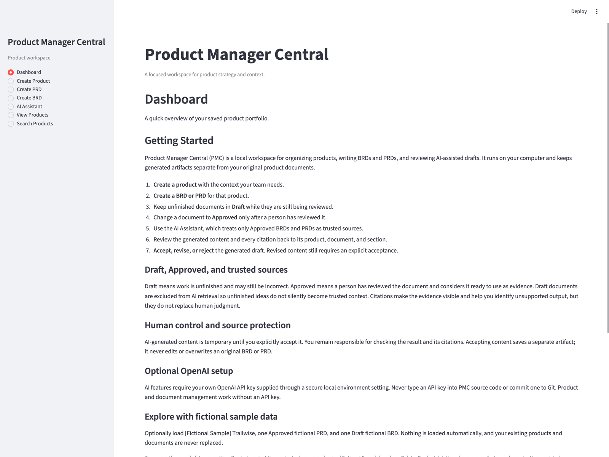
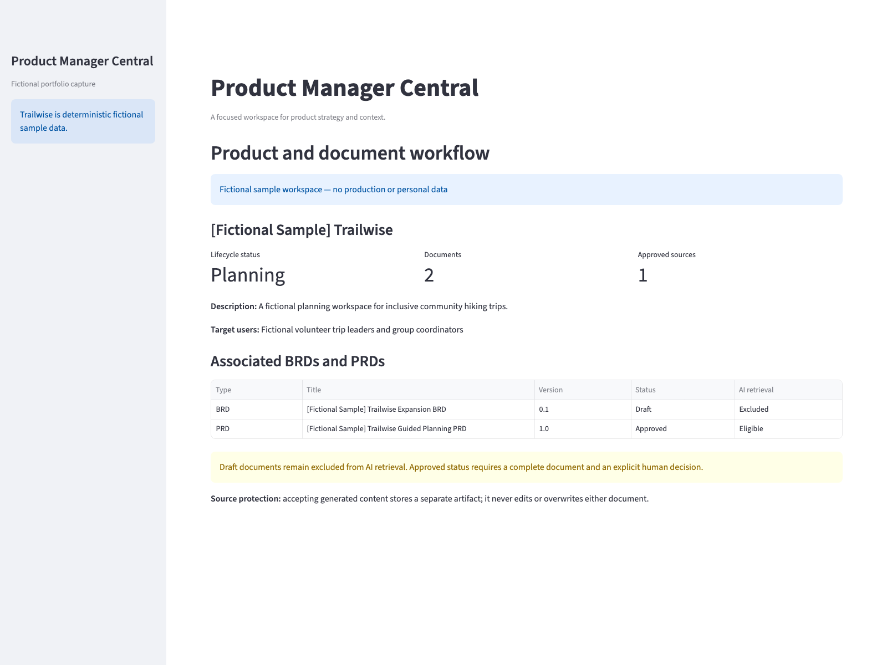
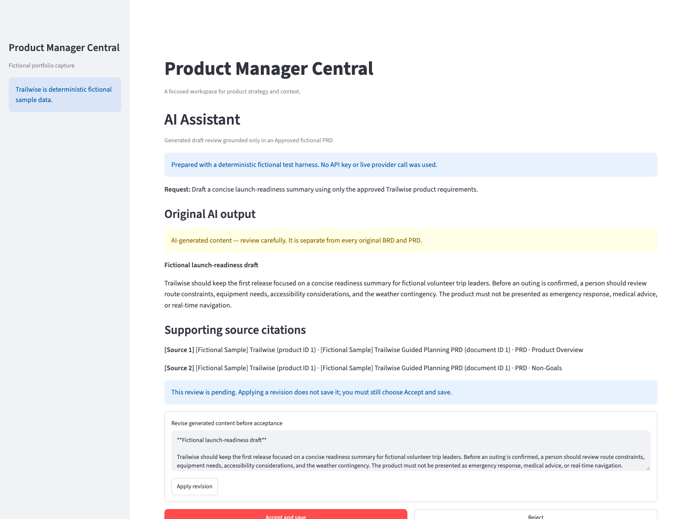

# Product Manager Central: Portfolio Case Study

## At a glance

Product Manager Central (PMC) is a local, single-user workspace for Product
Managers to organize product context, create and approve BRDs and PRDs, search
their portfolio, and review AI-assisted drafts grounded in approved documents.
It is implemented as a Streamlit application with local SQLite persistence.

PMC addresses a common product-management problem: important decisions are
spread across product records and long documents, while general-purpose AI
tools can blur the boundary between trusted source material and generated
content. PMC keeps those states explicit. A Product Manager decides which
documents are Approved, sees the source of generated claims, reviews every
draft, and must explicitly accept content before it is saved separately.

## Audience and workflow

PMC is designed for an individual Product Manager maintaining a local product
portfolio. The core workflow is:

1. Create structured product context and assign a lifecycle status.
2. Create product-associated BRDs and PRDs from stable templates.
3. Save incomplete work as Draft; approve only complete documents.
4. Search product information and review dashboard counts.
5. Optionally ask the AI Assistant for a draft grounded only in Approved BRD
   and PRD sections.
6. Inspect visible citations, revise or reject the draft, and use a separate
   **Accept and save** action when the result is ready to retain.
7. Review accepted generated artifacts without changing the original source
   documents.
8. Build and review typed Epic → Capability → Feature → User Story structures
   with independently owned measurable acceptance criteria.
9. Download any saved Draft or Approved BRD/PRD as a local Word or PDF file.

## Why local and single-user

The v1.0 design deliberately favors a transparent local application over a
hosted multi-user service. Product records, documents, and accepted artifacts
remain in a repository-local SQLite database. This keeps the MVP understandable
and reduces infrastructure scope while the workflow and safety model are being
validated.

That choice carries tradeoffs: PMC has no authentication, collaboration,
hosted backup, telemetry, or automatic cross-device synchronization. Users are
responsible for local backup and for deciding whether Approved document content
is authorized to be sent to the optional configured AI provider.

## Product and technical decisions

- **Structured records before AI:** product, BRD, and PRD workflows work
  without an API key. AI is optional and inactive by default.
- **Draft and Approved are meaningful states:** only complete, explicitly
  Approved BRDs and PRDs are eligible for retrieval.
- **Citations stay visible and traceable:** generated drafts identify the
  source product, document, type, section, and stable IDs used for grounding.
- **Human control is part of persistence:** generation creates an in-memory
  review state. Saving requires an explicit acceptance action.
- **Eligibility is checked again at acceptance:** if a cited source is deleted,
  edited, or changed from Approved to Draft, PMC blocks the save and asks the
  Product Manager to generate and review again.
- **Generated artifacts remain separate:** acceptance writes a distinct
  artifact and citation snapshot. It never appends to, overwrites, or otherwise
  modifies a source BRD or PRD.
- **Prompts are governed in source:** supported tasks map to immutable,
  versioned built-in prompts; hidden instructions are not editable in the UI or
  stored in SQLite.
- **Packaging fails closed:** a deterministic release builder includes only
  paths in an explicit manifest and rejects databases, secrets, backups,
  archives, caches, and other prohibited artifacts.
- **Agile output remains governed:** typed artifacts, hierarchy, criteria,
  citations, claim support, source gaps, and proposals are reviewed together;
  every profile uses the same fail-closed acceptance boundary.
- **Document export stays local and read-only:** Word and PDF use one ordered
  content model, path-safe filenames, and in-memory bytes without a provider or
  database write.

## Architecture and stack

PMC uses Python, Streamlit, SQLite, pandas, and the optional OpenAI Responses
and Embeddings APIs behind an injectable service boundary. Models, validation,
document templates, prompt definitions, retrieval, generation, review, and
persistence responsibilities are separated into focused modules. The detailed
data and trust flows are documented in [Architecture](ARCHITECTURE.md).

## Verification evidence

At Phase 10 Checkpoint 13, the repository provides integrated deterministic
coverage for validation, persistence, all seven Streamlit destinations,
onboarding, launchers, release metadata, package membership, Approved-only
retrieval, citations, typed Agile hierarchy and criteria, claim support, human
review, acceptance-time revalidation, source separation, and Draft/Approved
Word/PDF export. Tests use isolated temporary databases and fake or mocked
providers; they do not require a real API key or live OpenAI call.

Native clean-install validation is limited to macOS 26.5.2 arm64 with Python
3.14.6. Windows launchers and Python 3.11 through 3.13 have structural automated
coverage but have not completed native validation. Checkpoint 13 does not claim
an external beta, real-user outcomes, production usage, or a published release.

## Known limitations

- Single-user and local only; no authentication, roles, collaboration, cloud
  hosting, telemetry, billing, or hosted backup.
- Source launchers rather than signed or notarized native installers.
- Manual backup discipline is required because the database lives inside the
  application directory.
- Semantic retrieval may miss relevant wording or rank evidence imperfectly.
- Citations expose the supplied evidence path; they do not prove that a
  conclusion is correct.
- AI output may be incomplete, incorrect, stale, biased, or unsupported and
  remains subject to human review.
- Accepted generated artifacts are read-only and cannot be edited, deleted,
  regenerated, exported, or promoted automatically into source documents.
- Saved BRDs/PRDs export to Word and PDF, but native Google Docs export,
  analytics integration, and external beta results remain unavailable.

## Product-management lessons and next steps

PMC treats trust boundaries as product behavior rather than fine print. Status,
citations, review, and acceptance are visible parts of the workflow, and tests
cover failure states such as missing configuration, ineligible sources, stale
citations, rejection, and repeated acceptance.

Checkpoint 14 release-candidate verification and GitHub Release preparation are
complete. The deterministic local candidate, checksum, clean extracted
installation, no-key startup, integrated workflows, and draft release materials
passed their approved gates. Future validation should include native Windows
and additional Python versions, followed by the separately planned four-to-six-
Product-Manager beta using fictional or non-sensitive content. No tag, GitHub
Release, public distribution, or external beta has occurred.
